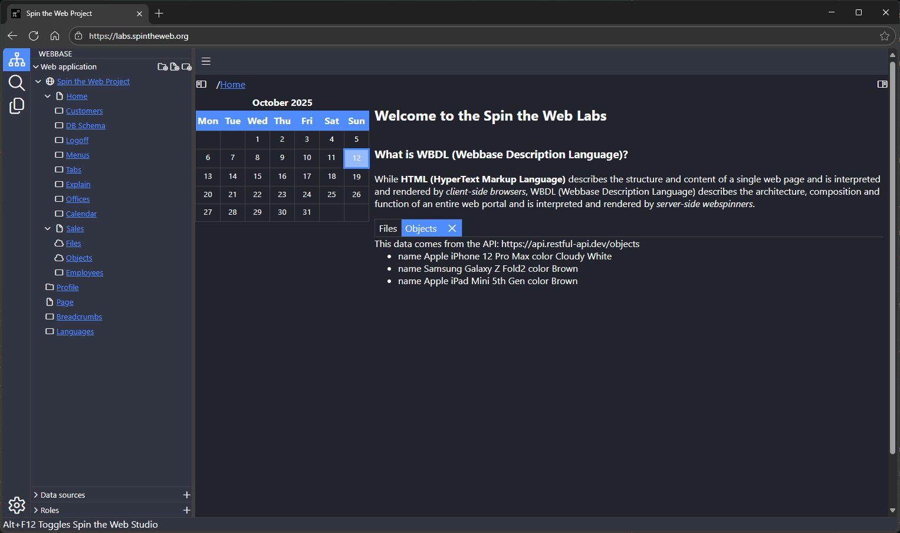

# Webspinner

Webspinner is the interpreter and runtime of WBDL (Webbase Description Language).

For the language and architecture details, see:
- the book https://github.com/spintheweb/book
- the Wiki https://github.com/spintheweb/webspinner/wiki
- the schemas https://github.com/spintheweb/schemas
